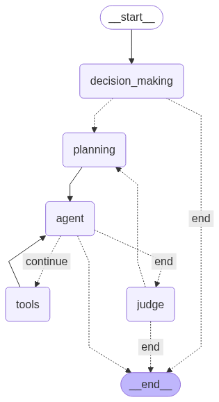

# Scientific Research Assistant with Agent
An AI-powered web application that assists users in scientific research by retrieving, reasoning over, and summarizing academic papers using LangGraph Agents and FastAPI. It supports chat-like interaction, dynamic tool reasoning, and tracks question-answer history.

---
## Work Flow of Agent

---
To understand it better, please refer to the Jupyter Notebook.
## Features

- Ask complex research questions in natural language
- LangGraph agent plans, searches, and synthesizes answers from research papers
- Step-by-step timeline of what AI is doing
- Final synthesized answer with citations
- Saves questions, answers, and AI steps in `history.json`
- Supports human feedback collection (via web popup)

---

##  Project Structure
```
Research_assistant/
├── app/
│   ├── tools/
│   │   ├── __init__.py
│   │   ├── core_api.py
│   │   ├── download.py
│   │   └── feedback.py
│   ├── utils/
│   │   ├── __init__.py
│   │   ├── config.py
│   │   ├── core_agent.py
│   │   ├── format.py
│   │   ├── history.py
│   │   └── prompts.py
│   ├── core_agent.py   
│   └── main.py
├── data/
│   └── history.json
├── frontend/
│   ├── static/
│   │   └── style.css
│   └── templates/
│       ├── history.html
│       └── index.html
├── notebook/ 
├── .env
├── .gitignore
├── README.md
├── requirements.txt
└── run.py
```
## Clone the repository
```bash
git clone https://github.com/sachin62025/Research_assistant.git
cd Research_assistant
```
### Add these API key in .env file 
 GOOGLE_API_KEY  
 CORE_API_KEY ## this site 'https://core.ac.uk/'
##  Create virtual environment and install dependencies
```bash
python -m venv venv
venv\Scripts\activate   # On Windows
pip install -r requirements.txt
```
## Run the FastAPI server
```bash
python run.py
```
